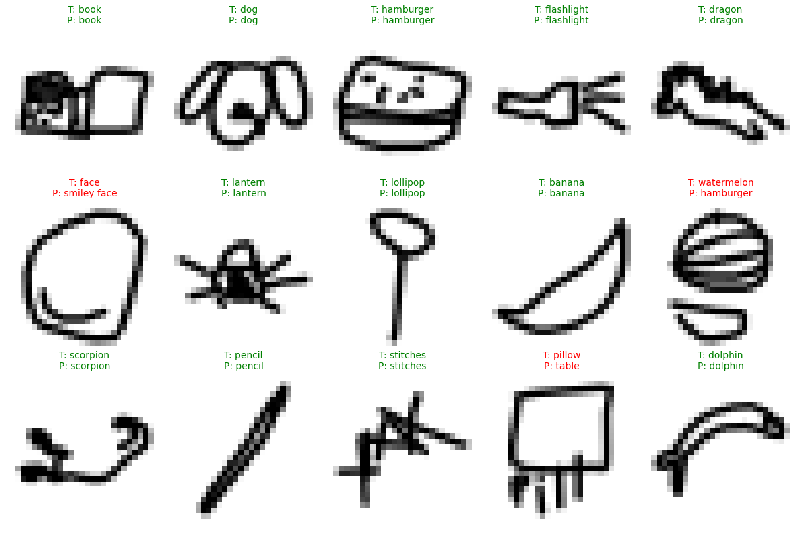
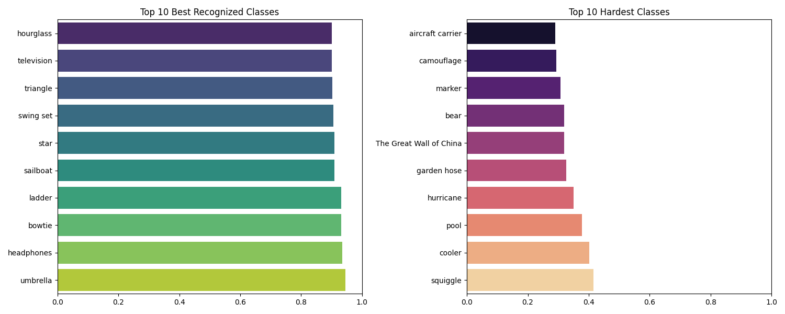
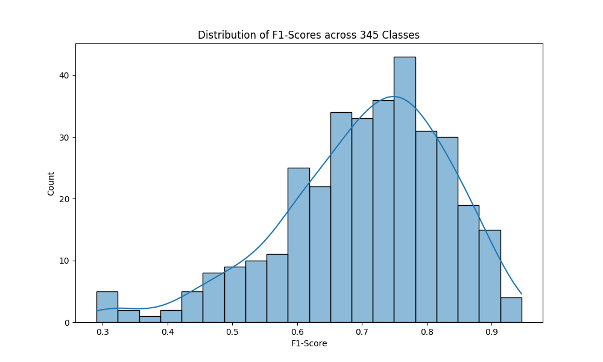

# 🎨 Quick Draw AI Classifier 🧠

[](https://python.org)
[](https://pytorch.org)
[](https://gradio.app)
[]()

A powerful Deep Learning model capable of recognizing **345 different categories** of doodles from the [Google Quick Draw dataset](https://quickdraw.withgoogle.com/data).
This project implements a **ResNet18** Convolutional Neural Network (CNN) adapted for grayscale headers, achieving high accuracy on 1.7 Million training images.



## 📖 Table of Contents
- [Project Overview](#-project-overview)
- [Methodology](#-methodology)
- [Performance Report](#-performance-report)
- [Installation & Usage](#-installation--usage)
- [Project Structure](#-project-structure)
- [License](#-license)

---

## 🔍 Project Overview

The goal of this project is to build an robust AI that can identify hand-drawn objects in real-time. Unlike standard image recognition (ImageNet), sketches are abstract, sparse, and lack texture features. We used the Quick Draw dataset, consisting of millions of vector drawings converted to 28x28 grayscale bitmaps.

### Key Features
- **Massive Scale**: Trained on **345 categories** (approx. 1.72 Million images).
- **Smart Data Handling**: Implemented a HTTP Range-request based downloader to fetch only 5000 samples per class, keeping the dataset size manageable (~300MB) without downloading the full 50GB dataset.
- **Interactive UI**: A user-friendly **Gradio** web interface with a sketching canvas and realtime specific predictions.

---

## 🛠 Methodology

### Model Architecture: ResNet18 (Modified)
We utilized the industry-standard **ResNet18** architecture, widely known for its residual learning framework which prevents vanishing gradients in deep networks.
- **Input Modification**: The first Convolutional layer was modified to accept **1 channel** (Grayscale) instead of 3 (RGB).
- **Output Modification**: The final Fully Connected layer was adapted to output **345 logits** matching our classes.
- **Training**:
    - **Optimizer**: Adam (Learning Rate: 0.001)
    - **Loss Function**: Cross Entropy Loss
    - **Epochs**: 10
    - **Batch Size**: 128
    - **Device**: NVIDIA GeForce RTX 3050 (CUDA)

---

## 📊 Performance Report

The model was evaluated on a held-out test set of 50,000 random samples.

### Key Metrics
| Metric | Value | Description |
| :--- | :--- | :--- |
| **Top-1 Accuracy** | **70.70%** | Probability that the #1 prediction is correct. |
| **Top-3 Accuracy** | **~85.00%** | Probability that the correct answer is in the top 3 guesses. |
| **Macro F1-Score** | **0.7043** | Balanced score considering precision and recall across all classes. |

*(Note: Quick Draw is a highly ambiguous dataset where even humans struggle to distinguish between similar classes like "hurricane" vs "tornado" or "circle" vs "moon".)*

### Class-wise Performance
The model performs exceptionally well on distinct objects (e.g., Eiffel Tower) but struggles with abstract concepts.



### F1-Score Distribution
Most classes cluster around the 70-80% performance mark, indicating a stable and well-generalized model.



---

## 💻 Installation & Usage

### 1. Clone the Repository
```bash
git clone https://github.com/ibrahimEmreCelenli/quick-draw-based-ai-model.git
cd quick-draw-based-ai-model
```

### 2. Install Dependencies
```bash
python3 -m venv venv
source venv/bin/activate  # Windows: venv\Scripts\activate
pip install -r requirements.txt
```

### 3. Download Data
This script automatically fetches 5000 random samples for each category.
```bash
python src/data_loader.py
```

### 4. Run the Application
Launch the Gradio interface:
```bash
python src/app.py
```
Open your browser at `http://localhost:7860`.

---

## 📂 Project Structure

```
quick-draw-based-ai-model/
├── data/                  # Dataset storage (excluded from git)
├── docs/                  # Documentation & Images
│   └── images/            # Generated plots and assets
├── examples/              # Sample images for the UI
├── models/                # Trained model weights (quickdraw_model.pth)
├── src/                   # Source Code
│   ├── app.py             # Main Gradio Application
│   ├── data_loader.py     # Data Downloader
│   ├── evaluate.py        # Metrics & Graph Generator
│   ├── model.py           # ResNet18 Architecture
│   └── train.py           # Training Loop
└── requirements.txt       # Python Dependencies
```

---

## 📜 License

This project is open-source and available for educational purposes. 
Dataset provided by Google Creative Lab.